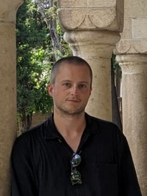

Welcome!

I am a PhD candidate in the [Department of Government and Politics at the University of Maryland, College Park](https://gvpt.umd.edu/){:target="_blank"}{:rel="noopener noreferrer"} and an incoming postdoctoral researcher in the [Department of International Relations at Bilkent University](https://ir.bilkent.edu.tr/){:target="_blank"}{:rel="noopener noreferrer"}, where I will work on the ERC-funded COUNSTER project. 

In my dissertation project, I advance a novel theory of rebel-civilian social ties to explain rebel groups' patterns of violence against civilians in civil war. I test my expectations with a mixed-methods research design using quantitative, computational and qualitative methodologies. In addition to collecting novel observational data and estimating measurement models for quantitative analyses, I conducted several rounds of fieldwork in Turkey to gather evidence via interviews with survivors of the Syrian civil war.

My work has been published in the *Journal of Peace Research*, *Social Science Quarterly*, *International Politics* and *German Politics*. Currently, I am a Civil War Paths Fellow with the [Centre for the Comparative Study of Civil War](https://www.civilwarpaths.org/){:target="_blank"}{:rel="noopener noreferrer"} at the University of York. I also serve as the managing editor of the *Journal of Conflict Resolution*.

At UMD I am a member of the [Interdisciplinary Laboratory of Computational Social Science](https://ilcss.umd.edu/){:target="_blank"}{:rel="noopener noreferrer"}. My enthusiasm for computational social science has led to several projects that lie apart from my research agenda on intrastate conflict. These projects center on media politics and coercive institutions in autocracies and employ custom webscrapers, named entity recognition, sentiment analysis and classification with large-language models for data generation and analysis. 

Before coming to the United States, I completed an MA in International Studies/Peace and Conflict Research at Goethe University Frankfurt and a BA in American Studies at Leipzig University. During my time as an undergraduate and graduate student in Germany I was an exchange student in the United States and Turkey on German Academic Exchange Service and European Union scholarships. In addition, I worked in research roles at Peace Research Institute Frankfurt and the Max Planck Institute for Social Anthropology.

Feel free to reach out to me with any question you might have.
